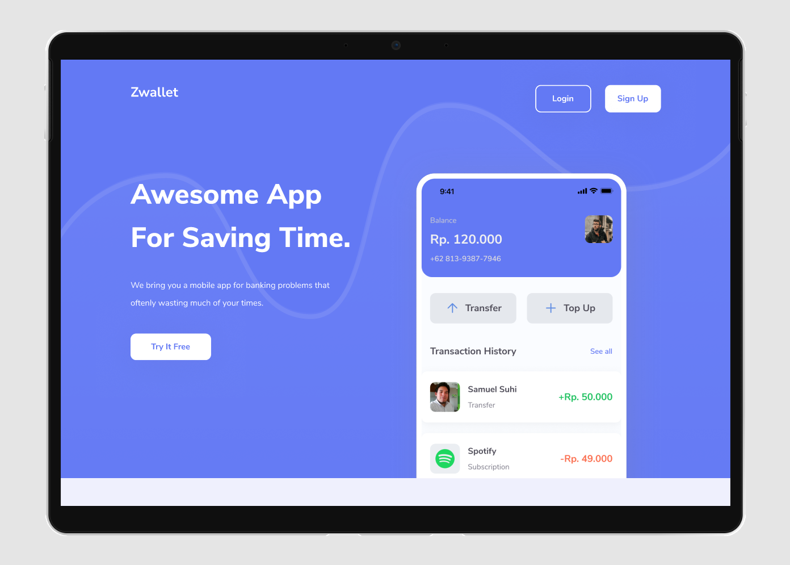
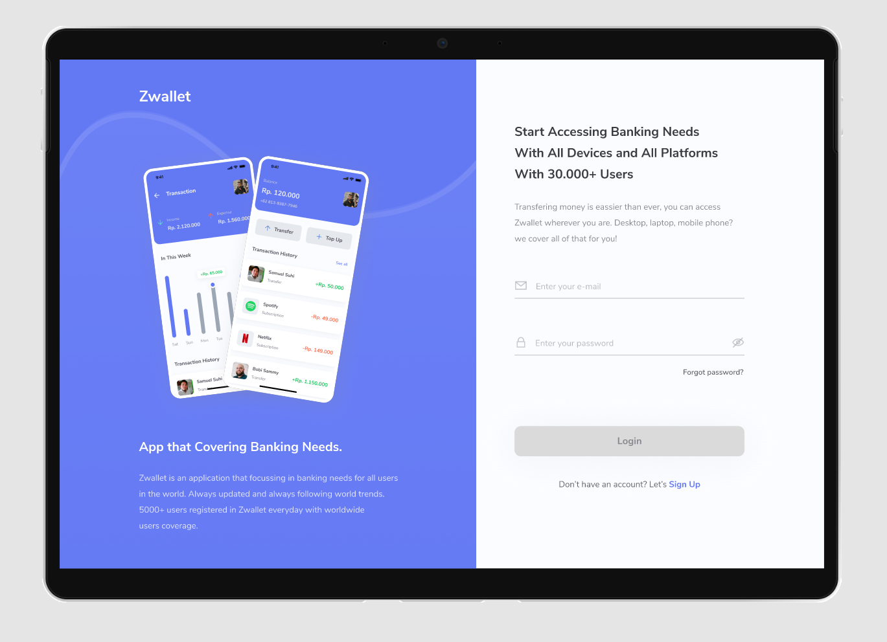
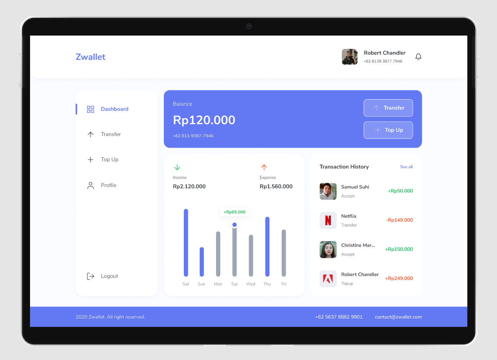

<h1 align="center">Fipay - NEXT JS</h1>
<h4 align="center">Tickie is a website-based application that can help users in getting the latest fillm information and making online bookings and payment.</h4>

<hr>

[](https://axios-http.com/docs/intro)
[](https://getbootstrap.com/)
[](https://www.chartjs.org/)
[](https://www.npmjs.com/package/js-cookie)
[](https://nextjs.org/)
[](https://www.npmjs.com/package/next-cookies)
[](https://reactjs.org/)
[](https://react-bootstrap.github.io/)
[](https://www.npmjs.com/package/react-chartjs-2)
[](https://reactjs.org/docs/react-dom.html)
[](https://react-dropzone.js.org/)
[](https://react-icons.github.io/react-icons/)
[](https://www.npmjs.com/package/react-modal)
[](https://www.npmjs.com/package/react-paginate)
[](https://react-redux.js.org/)
[](https://www.npmjs.com/package/react-router-dom)
[](https://redux.js.org/)
[](https://www.npmjs.com/package/redux-logger)
[](https://www.npmjs.com/package/redux-persist)
[](https://www.npmjs.com/package/redux-promise-middleware)

<br>

## **Contents**

- [**Requirement**](#requirement)

- [**Installation**](#installation)

- [**Demo**](#demo)

- [**License**](#license)

<br>

## **Requirement**

- Node.js
- node_modules : npm install or yarn install
- Backend API

<br>

## **Installation**

- Clone this repository

```bash
$ git clone https://github.com/luthfidiqi/Fipay.git
```

- Open Project Folder

```
$ cd Fipay
```

- Instal Depedencies

```
$ npm install
```

- Add env in next.config.js

```
URL_BACKEND=
```

- Run the Project

```
$ npm run dev
```

<br>

## **Demo**

### Link Website : [https://fipay.vercel.app/]

<hr>

<div display="flex">



</div>

<hr>

<br>

## License

© [Luthfi Thufail Asiddiqi](https://github.com/luthfidiqi/)
